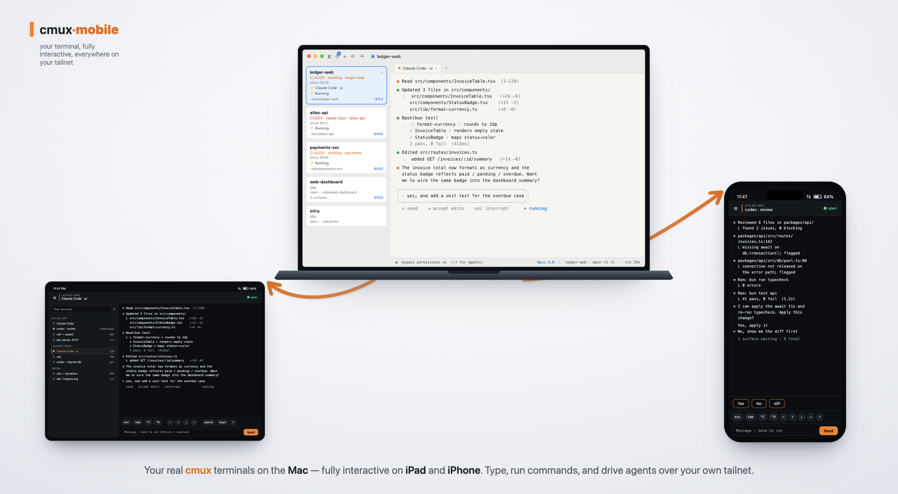

# cmux-mobile

**A full, interactive terminal on your phone — drive your Mac's real cmux terminal sessions from iPhone or iPad, over your own Tailscale tailnet.**



Drive your Mac's real **[cmux](https://cmux.com) terminal sessions from an iPhone or iPad** — a full, interactive terminal in your pocket: type, run commands, and steer coding agents in your actual Mac panes, over your own Tailscale tailnet, with no cmux cloud account and no app to install on the phone.

cmux exposes its panes only through a local Unix-domain socket. `cmux-mobile` is a small **bridge** that runs on your Mac, speaks that socket, and serves a **web app (PWA)** you open in mobile Safari and add to your Home Screen — a real, drivable terminal, not a viewer. Traffic stays inside your tailnet (WireGuard-encrypted); nothing goes to a third party.

## Prerequisites

- **[cmux](https://cmux.com)** installed and running on macOS (**≥ 0.64**) — the terminal multiplexer this app bridges to. cmux-mobile does nothing on its own; it connects to a cmux terminal that's already running and gives you full interactive control of its panes from your phone.
- **[Tailscale](https://tailscale.com)** installed and signed in on **both** the Mac **and** the phone, on the same tailnet.
- **[Bun](https://bun.sh)** on the Mac (`brew install oven-sh/bun/bun`) — cmux-mobile is a Bun program.

## Install & run

```bash
git clone https://github.com/jordjones/cmux-mobile.git && cd cmux-mobile
bun run setup               # installs deps, builds, and installs a launchd login agent
```

The bridge prints a URL like `http://100.x.y.z:4380` (your Mac's tailnet IP). Prefer to run it in the foreground instead of as a login agent? Use `bun run bridge` (Ctrl-C to stop).

## On the phone (same tailnet)

1. Open that URL in **Safari**.
2. After `bun run setup` (which runs in **`tailnet`** mode) you're connected immediately — any device on your own tailnet, no code. If you instead run `bun run bridge` (which defaults to **`token`** mode), enter the 6-digit pairing code from the log — or mint one headlessly from the repo: `bun run dist/cli.js pair add "iPhone"` (prints a one-tap URL).
3. **Share → Add to Home Screen** for a full-screen app.

Pick a terminal from the ☰ menu, tap the compose bar to type, Send to run, and use the bottom toolbar for `esc` / `^C` / arrows / a "more keys" sheet. Scroll to the top for history; tap the title to copy `workspace / tab`.

## Manage

```bash
bun run dist/cli.js pair list
bun run dist/cli.js pair revoke <id>
bun run dist/cli.js uninstall   # remove the launchd agent
```

## Configuration (env)

| Var | Default | Meaning |
|---|---|---|
| `CMUX_BRIDGE_HOST` | auto (tailnet IP, else loopback) | bind address |
| `CMUX_BRIDGE_PORT` | `4380` | listen port |
| `CMUX_BRIDGE_AUTH` | `token` (code default); `tailnet` (set by `bun run setup`) | `tailnet` = any device on your own tailnet, no code; `token` = identity + per-device bearer token; `off` = no gating (local dev only) |
| `CMUX_BRIDGE_NOTIFY_URL` | — | optional [ntfy](https://ntfy.sh) topic / webhook POSTed when a surface needs input (e.g. an agent hits `[y/n]`) — works even with the PWA closed |
| `CMUX_BRIDGE_LABEL` | `dev.cmuxmobile.bridge` | launchd agent label |

> The code default is `token`; the launchd agent installed by `bun run setup` sets `CMUX_BRIDGE_AUTH=tailnet`. So `bun run bridge` with no env demands a pairing token, while the `setup` install lets any device on your own tailnet connect with no code.

> Note: the rendered screen text is **monochrome** — cmux's socket returns plain UTF-8 with no ANSI colour, so the screen arrives flat. The Claude/Codex TUIs, vim, etc. are fully readable and fully drivable, just without colour.

## Security

Typing into a live pane is remote code execution, so by default the bridge requires a **tailnet identity** (`tailscale whois`, fail-closed); in `token` mode it additionally requires a **per-device bearer token** (only its SHA-256 is stored; revocable). Loopback (the Mac itself) is trusted for local dev. Encryption is WireGuard (Tailscale); the bridge runs plain HTTP/WS *inside* the tailnet under a single-user/trusted-tailnet assumption. Typed input is never logged. The optional notify webhook sends only a workspace name (never terminal contents).

## Develop

```bash
bun install
CMUX_BRIDGE_AUTH=off bun run bridge     # local dev (loopback trusted, no token)
bun run typecheck
bun test
bun run build                           # produce a publishable dist/ (bundled CLI + prebuilt web)
```

```
packages/protocol/   shared WS message types + screen checksum
packages/bridge/      Bun service: cmux socket <-> WebSocket (+ auth, events, mirror, watcher, CLI)
packages/web/         PWA: terminal grid + input + surface picker + settings
scripts/              build, smoke/e2e, capability probes, pairing, launchd helpers
```
